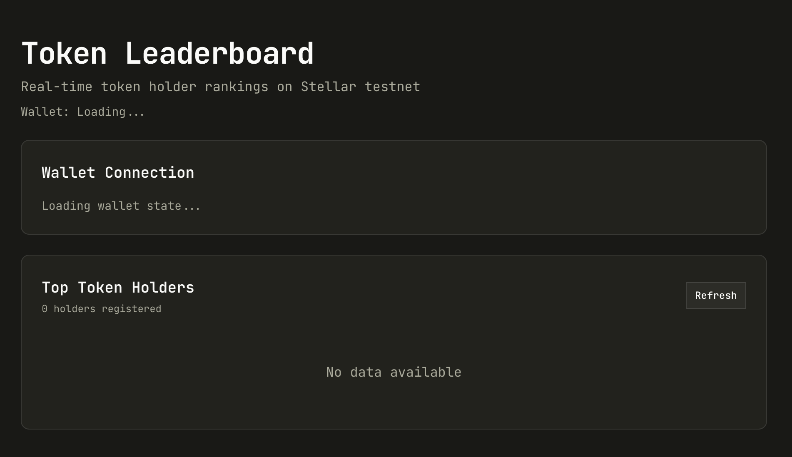

# Token Leaderboard (Stellar Soroban)

A polished multi-wallet leaderboard dApp on Stellar testnet, built with Next.js + shadcn/ui, with wallet-based interactions and Soroban contract integration.

| Item | Value |
|---|---|
| Live Demo | `https://token-leaderboard-zeta.vercel.app` |
| Deployed Contract Address | `CB2J4VBSTIC7W62POHMFX4U2DMDKEPZ5FYI4LECWH2ZBP3W6Y3SOD225` |
| Contract Call Transaction Hash | `9a79ded9601894482a17c9438b03d8f4a3dc5f01c42a30241f600a580436b422` |
| Explorer Link | `https://stellar.expert/explorer/testnet/tx/9a79ded9601894482a17c9438b03d8f4a3dc5f01c42a30241f600a580436b422` |



## Features

- Multi-wallet connection (Stellar Wallets Kit)
- Persistent wallet connection state across refresh
- Explicit disconnect state handling with local storage persistence
- Real-time leaderboard from Horizon + backend refresh routes
- Soroban contract call utilities and transaction status reporting
- Robust UI error handling for wallet/network edge cases

## Tech Stack

| Layer | Stack |
|---|---|
| Frontend | Next.js 16, React 19, TypeScript, Tailwind CSS, shadcn/ui |
| Wallet | `@creit.tech/stellar-wallets-kit` |
| Backend/API | Next.js Route Handlers, MongoDB, Mongoose |
| Blockchain | Stellar Horizon + Soroban RPC |
| Smart Contract | Rust (Soroban) |

## Local Setup

### 1. Prerequisites

- Node.js 18+
- npm
- Rust toolchain + Soroban CLI
- A Stellar testnet wallet/account

### 2. Install dependencies

```bash
npm install
```

### 3. Configure environment

```bash
cp .env.example .env
```

Update `.env` values:

| Key | Description |
|---|---|
| `NEXT_PUBLIC_SOROBAN_RPC_URL` | Soroban RPC endpoint (testnet default provided) |
| `NEXT_PUBLIC_NETWORK_PASSPHRASE` | Network passphrase (testnet default provided) |
| `NEXT_PUBLIC_CONTRACT_ID` | Your deployed Soroban contract address |
| `NEXT_PUBLIC_HORIZON_URL` | Horizon endpoint (testnet default provided) |
| `MONGODB_URI` | MongoDB connection string |

### 4. Start the app

```bash
npm run dev
```

Open: `http://localhost:3000`

## API Endpoints

| Method | Route | Purpose |
|---|---|---|
| `POST` | `/api/users` | Create/update connected wallet user |
| `GET` | `/api/leaderboard` | Fetch cached leaderboard |
| `GET` | `/api/leaderboard?refresh=true` | Refresh from Horizon and return leaderboard |
| `POST` | `/api/leaderboard/refresh` | Trigger manual refresh |
| `GET` | `/api/health` | Health check |

## Soroban Contract

### Build

```bash
cd contracts/token-leaderboard
soroban contract build
```

### Deploy (testnet)

```bash
soroban config network add \
  --name testnet \
  --rpc-url https://soroban-testnet.stellar.org \
  --network-passphrase "Test SDF Network ; September 2015"

soroban contract deploy \
  --wasm target/wasm32-unknown-unknown/release/token_leaderboard.wasm \
  --source <your-public-key> \
  --network testnet
```

Use the returned contract ID as `NEXT_PUBLIC_CONTRACT_ID`.
